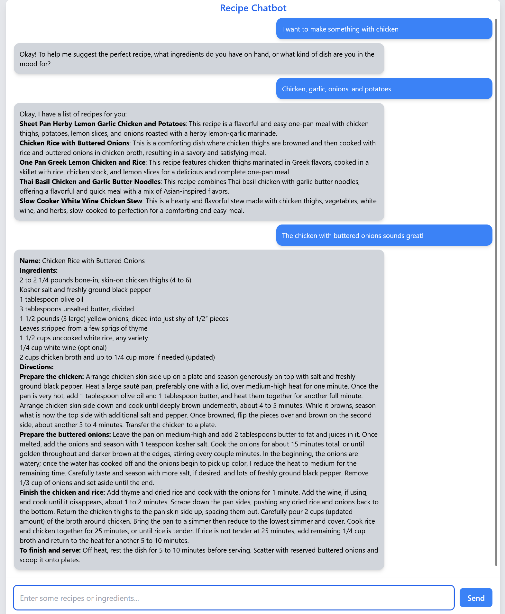

# LangChain_Demo
## Setup Instructions
1. Clone the repository:
```bash
git clone https://github.com/jgray7693/LangChain_Demo.git
cd LangChain_Demo
```
2. Set up a virtual environment.
```bash
python3 -m venv env
source env/bin/activate
```
3. Install dependencies
```bash
pip install -r requirements.txt
```
4. Create .env file and input Gemini api key
```python
GEMINI_API_KEY=<your_api_key>
```

## Project Design Overview
This LangChain demo leverages the LangChain framework to develop a vector-store RAG application powered by Gemini LLM. The project's primary purpose is to showcase the various methods that an LLM and AI can be used to manipulate and alter data, and provide a user with a natural language interface to extract relevant information. The methods used are as follows:
### Ingest
* The recipe files are stored as individual `.html` files.
* Each file is cleaned down to plain text using `BeautifulSoup (bs4)`. 
* The extracted text is sent to the Gemini LLM in batches to extract structured recipe details, including:
  * Name
  * Ingredients
  * Instructions
* The processed recipes are stored in a JSON file for later retrieval.
* Using Gemini’s generous free tier significantly reduces manual processing time.
### Vector store
* The JSON file is parsed to extract each individual recipe.
* Recipes are embedded using `GoogleGenerativeAIEmbeddings` from LangChain.
* The embeddings are stored in a ChromaDB vector database through LangChain toolkit.
* This allows semantic search to retrieve the most relevant recipes based on a user’s query.
### Chat
* The chatbot is designed to guide users towards providing either:
  * A dish name
  * A list of ingredients
* If a dish name or ingredients are provided, the chatbot:
  * Extracts the relevant keywords from the user’s message.
  * Queries the vector store to find similar recipes.
  * Displays a list of relevant recipes.
* When a user selects a recipe, the chatbot provides the full ingredients list and instructions for making that dish.

## Usage examples
### Running the main script
To start the server, run the following command in your terminal:
```bash
uvicorn main:app #optionally --reload
```
Once the server is running, navigate to:
```
http://127.0.0.1:8000/
```
Interact with the recipe chatbot by providing:
* A dish name (e.g., *“I want to make lasagna”*).
* A list of ingredients (e.g., *“I have chicken, tomatoes, and garlic”*).

The chatbot will return similar recipes from the database. When you select a recipe, it will display the ingredients and instructions for that dish.

## Chatbot Interface
Here is an example of an interaction with the chatbot:

